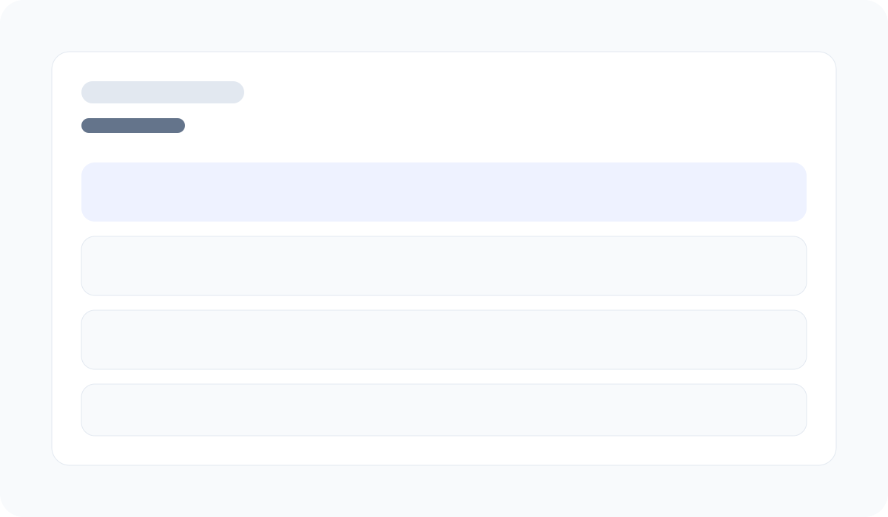

# StudyBloom AI

StudyBloom AI is a student-first study planner that turns a busy week into a calm, realistic weekly schedule. It is designed for students balancing coursework, deadlines, work, and energy levels in one place.

## Live demo

Open the app here: https://study-bloom.vercel.app

## What problem it solves

Many students feel overwhelmed because they know they should study, but they do not know how to turn their workload into a plan that fits real life. StudyBloom AI helps them break the week into manageable study blocks, protect their energy, and focus on the most important tasks.

## Features

- Enter courses, deadlines, weekly hours, focus areas, and preferred study days
- Generate a weekly study plan with day-by-day focus and task suggestions
- Get AI-style coaching advice tailored to your current workload
- Save the latest plan locally in the browser for quick access
- Clean, calming interface designed for student use

## AI feature

The AI coach uses a custom system prompt that instructs the app to act like a calm, encouraging study mentor. It should help the student prioritize, protect energy, and keep advice practical rather than overwhelming.

### Prompt used

You are StudyBloom AI, a calm and practical study coach. You help students stay grounded, protect energy, and focus on the next useful action. Always answer with encouraging, specific advice and keep it concise.

## Tools and services used

- Next.js
- React
- TypeScript
- Tailwind CSS
- Lucide icons
- Vercel for deployment

## Screenshots





## How to run locally

```bash
npm install
npm run dev
```

Then open http://localhost:3000.
